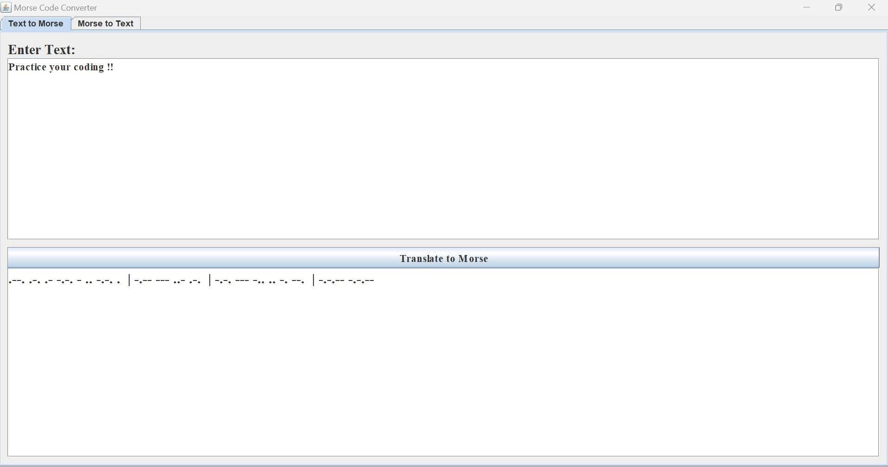
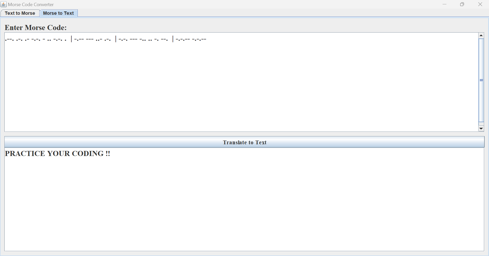

# Morse Code Converter (Text & Morse to Text)

A Java Swing/AWT-based application that enables users to convert between plain text and Morse code seamlessly. The application features a tabbed interface, with separate sections for Morse to Text and Text to Morse conversions. It supports numbers and special characters, making it versatile for various use cases.

## Features

- Convert plain text to Morse code
- Convert Morse code to plain text
- Supports numbers (0-9) and special characters (e.g., .,?,!,@,#,$,%,&, etc.)
- Intuitive tabbed GUI with two dedicated sections:
  - **Morse to Text**
  - **Text to Morse**
- Easy to use with input fields, buttons, and clear options

## Demo





## How to Run

1. Download or clone the repository.
2. Ensure you have Java Development Kit (JDK) installed (version 8 or higher recommended).
3. Compile the Java source files:

```bash
javac MorseCodeTranslator.java
